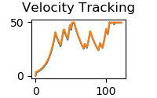

## Longitudinal and lateral controllers for autonomous vehicles

### Features PID and enhanced Stanley controllers
### Implementation runs on the CARLA simulator

### Whats new...

* Formatting improved for console readouts

* A negative velocity control signal triggers the vehicle to put itself into reverse and
  the vehicle's CRP (Current Reference Point) for the Stanley lateral controller is set to the RRP (Rear Reference Point) instead of the normal FRP (Front Reference Point).

- Better modularization of autonomous software system functions and capabilities

* Runtime display panels configuration options have been enhanced

* Can select which metrics of the runtime controls and state to display

* Velocity units can be set to mps, kmph or mph

* Size of the panels can be set to given dimensions

* Vertical or horizontal orientation of the panels an be specified for both controls and trajectory

* If a particular runtime display panel type is not set in options config then defaults are used

### Videos are finally being released!

Full length video of the racetrack run with side panel runtime readouts is here:

https://www.youtube.com/watch?v=4t0qOREr42g&t=4s

Reverse drive controller test

https://www.youtube.com/watch?v=pFygqVfalNw

### About...
Final project for Course 1 in University Of Toronto (Coursera) Self-Driving Car Specialization . The longitudinal controller was a PID and the lateral controller was based on the Stanford Stanley controller design with  modifications to improve performance based on field testing results from the simulator. The controller uses both runtime metrics and historical averages over the run of the track to dynamically adjust. The result is an average crosstrack error of only 0.07 meters  (7 cm) for the entire run. The original project was redeveloped into more modularized and enhanced simulation environment. Includes additions for detailed  readouts (on the right panel) of runtime performance metrics and feedback measurements used by the controllers. Extensions were also implemented for enhanced graphical display panels of runtime metrics for a customizable dashboard.

Another improvement was made to stabilize steering jitter. This occurs when the steering error is extremely small and very close to zero numerically. The controller feedback error rapidly oscillates about zero and so does the signal output to the steering actuator. The numerical evaluation of what is zero was expanded about numeric zero. The new "zero" is an interval about zero and the steering is held steady were it is for error offsets within this bounded region.

The readouts include: runtime (MM:SS), position (x,y), orientation (yaw), speed (forward velocity), velocity vector with (+/-) for  direction (the  car can go backwards!), velocity errors (running and averages), vehicle position reference point (crp), next path waypoint (nwp), path & crosstrack angles, crosstrack error (with side indicator), and delta steering angle and related error offset

One quick check for accuracy is to compare realtime speed (kmph) in from the built-in simulator heads-up display to the right panel readout for speed (kmph) based on runtime feedback from the simulator itself. The panel also calculates the speed in mph and mps (meters per second).

 
 

 

