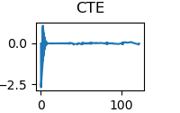
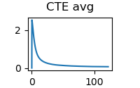
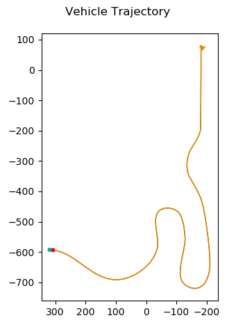

## Longitudinal and lateral controllers for autonomous vehicles

### Features PID and enhanced Stanley controllers

- Original UoT project redeveloped into a modularized and enhanced simulation environment
  
- Detailed realtime readouts of runtime performance metrics and feedback measurements used by the controllers
  
- Enhanced graphical display panels of runtime metrics using a customizable dashboard

- Complete runtime data saved for further analysis
  
- Runs on the CARLA simulator

### Whats new...

* Formatting improved for console readouts

* A negative velocity control signal triggers the vehicle to put itself into reverse and
  the vehicle's CRP (Current Reference Point) for the Stanley lateral controller is set to the RRP (Rear Reference Point) instead of the normal FRP (Front Reference Point).

- Better modularization of autonomous software system functions and capabilities

* Runtime display panels configuration options have been enhanced

* Can select which metrics of the runtime controls and state to display

* Velocity units can be set to mps, kmph or mph

* Size of the panels can be set to given dimensions

* Vertical or horizontal orientation of the panels an be specified for both controls and trajectory

* If a particular runtime display panel type is not set in options config then defaults are used

### Videos are released!

Full length video of the racetrack run with side panel runtime readouts

https://www.youtube.com/watch?v=4t0qOREr42g&t=4s

Reverse drive controller test - https://www.youtube.com/watch?v=pFygqVfalNw

Stuck throttle at 90% over test! -  https://www.youtube.com/watch?v=bbDEMzL18cg

### About...
Final project for Course 1 in University Of Toronto Self-Driving Car Specialization . The longitudinal controller was a PID and the lateral controller was based on the Stanford Stanley controller design with  modifications to improve performance based on field testing results from the simulator. The controller uses both runtime metrics and historical averages over the run of the track to dynamically adjust. The result is an average crosstrack error of only 0.07 meters  (7 cm) for the entire run. The original project was redeveloped into more modularized and enhanced simulation environment. Includes additions for detailed  readouts (on the right panel) of runtime performance metrics and feedback measurements used by the controllers. Extensions were also implemented for enhanced graphical display panels of runtime metrics for a customizable dashboard.

Another improvement was made to stabilize steering jitter. This occurs when the steering error is extremely small and very close to zero numerically. The controller feedback error rapidly oscillates about zero and so does the signal output to the steering actuator. The numerical evaluation of what is zero was expanded about numeric zero. The new "zero" is an interval about zero and the steering is held steady were it is for error offsets within this bounded region.

The readouts include: runtime (MM:SS), position (x,y), orientation (yaw), speed (forward velocity), velocity vector with (+/-) for  direction (the  car can go backwards!), velocity errors (running and averages), vehicle position reference point (crp), next path waypoint (nwp), path & crosstrack angles, crosstrack error (with side indicator), and delta steering angle and related error offset

One quick check for accuracy is to compare realtime speed (kmph) in from the built-in simulator heads-up display to the right panel readout for speed (kmph) based on runtime feedback from the simulator itself. The panel also calculates the speed in mph and mps (meters per second).

Detailed runtime results are dumped to data files at the end of the run for further analysis.

Graphics of the dashboard displays are also saved.

 
 

 

Full length video of the racetrack run with side panel runtime readouts is here:

https://www.youtube.com/watch?v=4t0qOREr42g&t=4s

### Malfunction Test - Unplanned Reversed Motion

In this demo, the car is using a longitudinal PID  controller and an enhanced Stanley design for the lateral controller. The original Stanley controller  was modified to improve performance based on field testing results from the simulator. The controller uses both runtime metrics and historical averages during the run on the track to dynamically adjust. 

This edge case test simulates that there is either an electro-mechanical, electronic or unknown system error that causes a malfunction in the actuators or there is an emergency override to the planned path with the same result. The idea is to see how well the controllers and vehicle handle and recover from this apparent malfunction, planned or not.

The test run initiates a manual override to the incoming waypoint stream being received from the local planner. The runtime displays, both panel readouts and realtime graphic displays show the effect of an abrupt unplanned sequence of stop, reverse, stop and forward again, while attempting to following the path plan as usual with the controllers still receiving and trying to respond to the nominal reference trajectory signals.

See the video here: https://www.youtube.com/watch?v=pFygqVfalNw

### Stuck At 90% Over-Throttle Test!

This edge case test simulates that there is either an electro-mechanical, electronic or unknown system error that causes a malfunction in the actuators. The idea is to see how well the controllers and vehicle handle and recover from a serious system failure.

The test run simulates a throttle that is stuck at 90% over the input signal from the nominal path plan. 

Vehicle motion, panel readouts and realtime graphic displays show the incredible response from the controllers to attempt to continuously and dynamically stabilize the vehicle and get it back on the correct path.

These are the same controllers used in the normal run (see    • Autonomous Vehicle Racetrack Run - PI...  . They were not modified for this particular test! Shows the inherent robustness of the design.

Could a human driver have done any better considering the type of severe actuator failure that occurred in a fly-by-wire vehicle?

See the video at https://www.youtube.com/watch?v=bbDEMzL18cg

